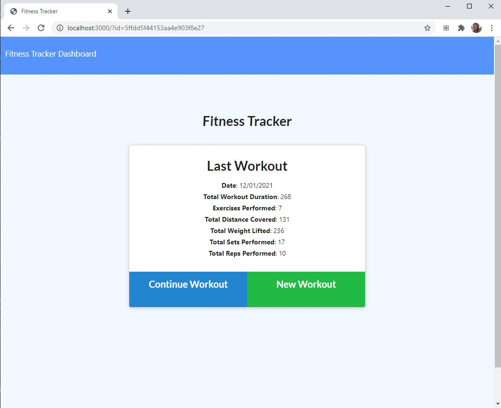
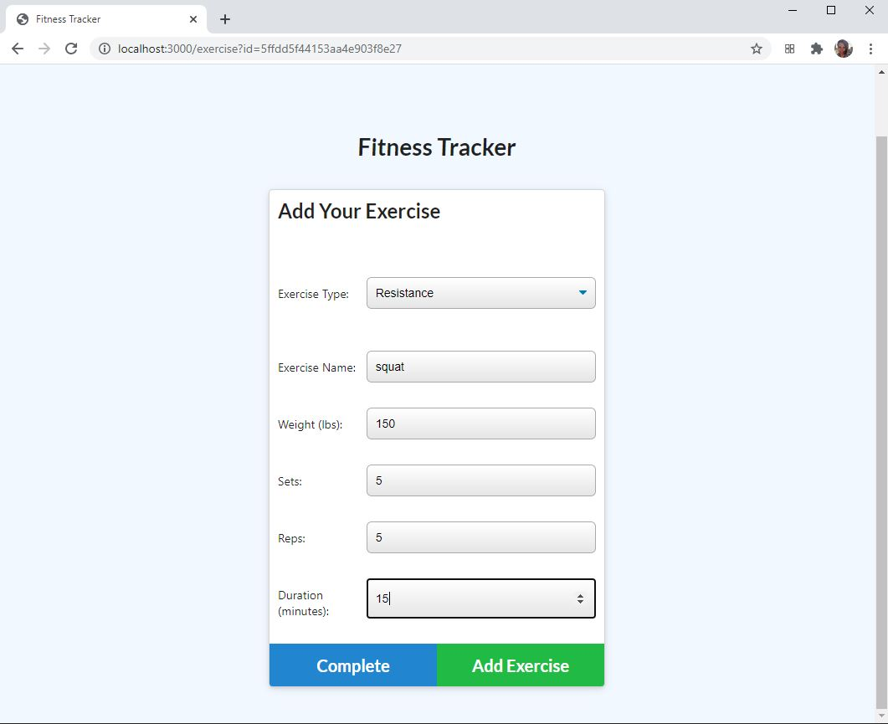
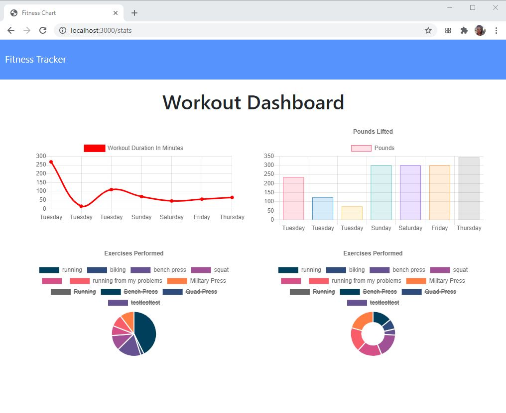

# sprintversl'est 

# Table of contents
1. [Description](#Description)
2. [Installation instructions](#Installation-instructions)
3. [Usage](#usage)
4. [Contributions](#Contributions)
5. [Testing instructions](#Testing-instructions)
6. [License](#License)
7. [Questions](#Questions)

## Description: 
This is a fitness tracker app that allows users to enter multiple exercises for each workout, as well as keep track of total pounds lifted, total miles travelled, and duration of workouts. Users can also view data for the past 7 workouts.

This application is deployed in <a href='https://fathomless-ridge-85219.herokuapp.com/'>heroku.</a> 

The user is greeted with the following screen:

Users can enter exercises:

User can view dashboard:

## Installation instructions: 
Users should run npm install upon downloading the application such that all packages will be installed, then they should seed the seed file.

## Usage: 
This is for a user who works out every day and wants to keep track of their data. 

## Contributions: 
This is currently a solo project of skolnikskolnik.

## Testing instructions: 
Users can test the post/put routes in postman or in their browser.

## License:  
This project is covered under the MIT License license.

## Questions
Visit my <a href='https://www.github.com/skolnikskolnik'>github page.</a> 

Email me at jtskolnik@gmail.com with any additional questions you may have. I am always happy to talk to users of my product!